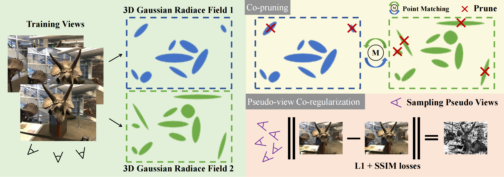

# CoR-GS
This is the official repository for our ECCV2024 paper **CoR-GS: Sparse-View 3D Gaussian Splatting via Co-Regularization**.

[Paper](https://arxiv.org/pdf/2405.12110) | [Project](https://jiaw-z.github.io/CoR-GS/) | [Video](https://youtu.be/O83v9Wrn3c4)



## Abstract

3D Gaussian Splatting (3DGS) creates a radiance field consisting of 3D Gaussians to represent a scene. With sparse training views, 3DGS easily suffers from overfitting, negatively impacting rendering. This paper introduces a new co-regularization perspective for improving sparse-view 3DGS. When training two 3D Gaussian radiance fields, we observe that the two radiance fields exhibit point disagreement and rendering disagreement that can unsupervisedly predict reconstruction quality, stemming from the randomness of densification implementation. We further quantify the two disagreements and demonstrate the negative correlation between them and accurate reconstruction, which allows us to identify inaccurate reconstruction without accessing ground-truth information. Based on the study, we propose CoR-GS, which identifies and suppresses inaccurate reconstruction based on the two disagreements: (1) Co-pruning considers Gaussians that exhibit high point disagreement in inaccurate positions and prunes them. (2) Pseudo-view co-regularization considers pixels that exhibit high rendering disagreement are inaccurate and suppress the disagreement. Results on LLFF, Mip-NeRF360, DTU, and Blender demonstrate that CoR-GS effectively regularizes the scene geometry, reconstructs the compact representations, and achieves state-of-the-art novel view synthesis quality under sparse training views. 


## Installation

Tested on Ubuntu 18.04, CUDA 11.3, PyTorch 1.12.1

``````
conda env create --file environment.yml
conda activate corgs
``````

``````
pip install gaussian-splatting/submodules/diff-gaussian-rasterization-confidence
pip install gaussian-splatting/submodules/simple-knn
``````

## Required Data
```
├── /data
    ├── mipnerf360
        ├── bicycle
        ├── bonsai
        ├── ...
    ├── nerf_llff_data
        ├── fern
        ├── flower
        ├── ...
```

## Evaluation

### LLFF

1. Download LLFF from [the official download link](https://drive.google.com/drive/folders/128yBriW1IG_3NJ5Rp7APSTZsJqdJdfc1).

2. run colmap to obtain initial point clouds with limited viewpoints:
    ```bash
   python tools/colmap_llff.py
   ```

3. Start training and testing:

   ```bash
   # for example
   bash scripts/run_llff.sh ${gpu_id} data/nerf_llff_data/fern output/llff/fern
   ```

### MipNeRF-360

1. Download MipNeRF-360 from [the official download link](http://storage.googleapis.com/gresearch/refraw360/360_v2.zip).

2. run colmap to obtain initial point clouds with limited viewpoints:
    ```bash
   python tools/colmap_360.py
   ```

3. Start training and testing:

   ```bash
   # for example
   bash scripts/run_360.sh ${gpu_id} data/mipnerf360/bicycle output/mipnerf360/bicycle
   ```


### DTU

1. Download DTU dataset

   - Download the DTU dataset "Rectified (123 GB)" from the [official website](https://roboimagedata.compute.dtu.dk/?page_id=36/), and extract it.
   - Download masks (used for evaluation only) from [this link](https://drive.google.com/file/d/1Yt5T3LJ9DZDiHbtd9PDFNHqJAd7wt-_E/view?usp=sharing).


2. Organize DTU for few-shot setting:

   ```bash
   bash scripts/organize_dtu_dataset.sh $rectified_path
   ```

3. Format
   - Poses: following [gaussian-splatting](https://github.com/graphdeco-inria/gaussian-splatting), run `convert.py` to get the poses and the undistorted images by COLMAP.
   - Render Path: following [LLFF](https://github.com/Fyusion/LLFF) to get the `poses_bounds.npy` from the COLMAP data.

4. Set the mask path and the expected output model path in `copy_mask_dtu.sh` for evaluation. (default: "data/DTU/submission_data/idrmasks" and "output/DTU") 


5. run colmap to obtain initial point clouds with limited viewpoints:
    ```bash
   python tools/colmap_dtu.py
   ```
   When sparse views are used as input, COLMAP may fail due to poor co-visibility relationships between input images. In our tests, this issue can occur in some scenes within the 3-view DTU and 8-view Blender datasets. In these cases, we use random point clouds for initialization (--rand_pcd).


6. Start training and testing:

   ```bash
   # for example
   bash scripts/run_dtu.sh ${gpu_id} data/DTU/scan8 output/DTU/scan8
   ```


## Customized Dataset
Similar to Gaussian Splatting, our method can read standard COLMAP format datasets. Please customize your sampling rule in `scenes/dataset_readers.py`, and see how to organize a COLMAP-format dataset from raw RGB images referring to our preprocessing of DTU.


## Citation

Consider citing as below if you find this repository helpful to your project:

```
@article{zhang2024cor,
      title={CoR-GS: Sparse-View 3D Gaussian Splatting via Co-Regularization},
      author={Zhang, Jiawei and Li, Jiahe and Yu, Xiaohan and Huang, Lei and Gu, Lin and Zheng, Jin and Bai, Xiao},
      journal={arXiv preprint arXiv:2405.12110},
      year={2024}
    }
```

## Acknowledgement

Special thanks to the following awesome projects!

- [Gaussian-Splatting](https://github.com/graphdeco-inria/gaussian-splatting)
- [FSGS](https://github.com/VITA-Group/FSGS)
- [DNGaussian](https://github.com/Fictionarry/DNGaussian)